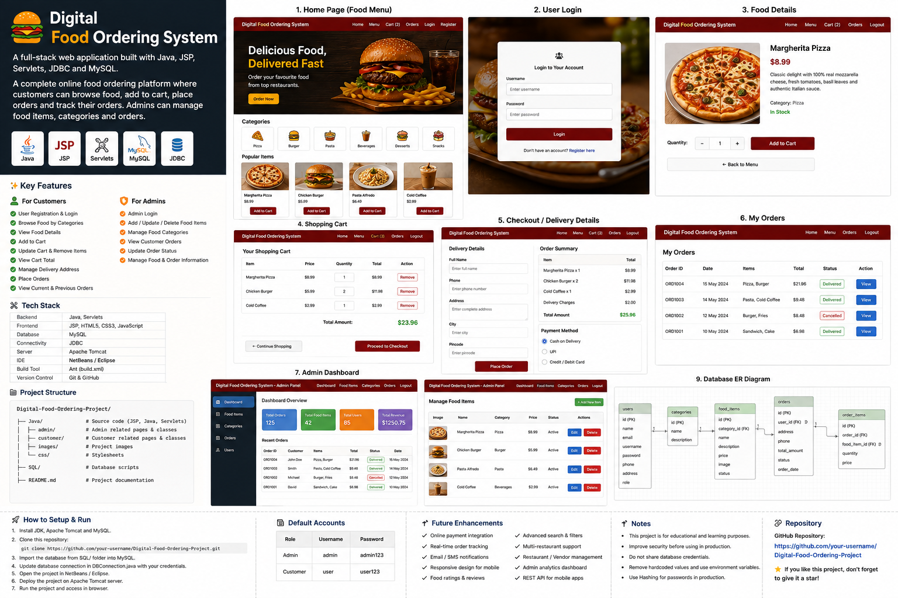
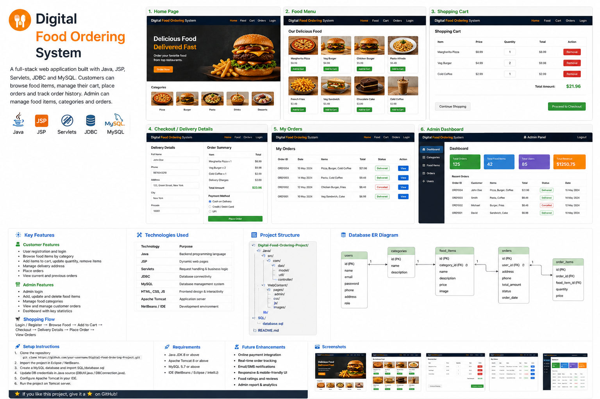

# 🍔 Digital Food Ordering System

A desktop-based **Digital Food Ordering System** built with **Java, Swing, JDBC and MySQL**. The application provides a complete food-ordering workflow for customers and a management workflow for administrators.

The project covers authentication, food/category management, cart operations, order placement, bill generation, customer order history and administrator order management.



## ✨ Highlights

### 👤 Customer Experience
- Customer registration and login
- Browse food items and categories
- View food-item details
- Add, update and remove cart items
- Calculate cart totals
- Place food orders
- Generate/view bills
- View order history
- Manage customer profile information

### 🛠️ Admin Experience
- Admin login
- Add, edit and delete food items
- Create and manage categories
- View customer orders
- Update order status
- Manage food and order records
- Admin password-change flow



## 🧾 Main Order Flow

```text
Login / Register
      ↓
Browse Categories
      ↓
Select Food Item
      ↓
Add to Cart
      ↓
Review / Update Cart
      ↓
Place Order
      ↓
Generate Bill
      ↓
View Order History
```

## 🏗️ Project Architecture

```text
Digital-Food-Ordering-System/
├── Java/
│   ├── src/              # Java source + NetBeans form files
│   ├── src/libs/         # Dependency notes; large third-party JARs are not committed
│   ├── nbproject/        # NetBeans project configuration
│   ├── build.xml         # Ant build configuration
│   └── manifest.mf
├── SQL/                  # MySQL schema/data scripts
├── docs/
│   └── images/           # README/project showcase images
├── .gitignore
└── README.md
```

## 🧩 Technology Stack

| Technology | Usage |
|---|---|
| **Java** | Application and business logic |
| **Java Swing** | Desktop user interface |
| **JDBC** | MySQL database connectivity |
| **MySQL** | Persistent application data |
| **NetBeans** | Project/GUI development |
| **Apache Ant** | Build automation |
| **Git & GitHub** | Version control |

## 🗄️ Database

The `SQL/` directory contains scripts for the application's main data areas:

- `foodordering_admin.sql`
- `foodordering_category.sql`
- `foodordering_fooditem.sql`
- `foodordering_signup.sql`
- `foodordering_bill.sql`
- `foodordering_billdetail.sql`

Create the required MySQL database, import these scripts, and update the application's database connection settings for your local environment.

## 🚀 Setup

### Prerequisites

- JDK 8+ (JDK 11/17 recommended if compatible with your installed libraries)
- MySQL Server
- NetBeans or another Java IDE that supports Ant projects
- Git

### 1. Clone the repository

```bash
git clone <YOUR_GITHUB_REPOSITORY_URL>
cd Digital-Food-Ordering-System
```

### 2. Configure MySQL

Create your local database and import the SQL scripts from the `SQL/` directory.

Then update the database connection in the Java source to match your local:

```text
Host: 127.0.0.1
Port: 3306
Database: <your_database>
Username: <your_username>
Password: <your_password>
```

### 3. Open the project

Open the `Java/` directory as an **Apache Ant / NetBeans project**.

Restore the required third-party libraries under `Java/src/libs/` and make sure they are available on the project classpath. Large JAR files are intentionally excluded from GitHub.

### 4. Build and run

Use NetBeans to build and run the appropriate application entry point. The project includes separate customer and admin flows.

## 🔐 Security & Production Improvements

This is an educational/portfolio project. Before production use, improve it by:

- Hashing passwords with a modern password-hashing algorithm
- Replacing string-concatenated SQL with `PreparedStatement`
- Moving database credentials to environment variables/configuration
- Adding stronger validation and exception handling
- Removing unnecessary client-side exposure of sensitive data
- Adding role-based authorization checks
- Adding automated tests and structured logging

## 📸 Project Showcase

The repository includes generated showcase visuals under `docs/images/` so the GitHub README has a clear visual presentation without depending on external image-hosting services.

## 🔮 Future Enhancements

- Online payment integration
- Order notifications
- Delivery tracking
- Food ratings and reviews
- Advanced search and filtering
- Restaurant/vendor management
- Admin analytics dashboard
- REST API layer
- Mobile application client
- Cloud database/deployment

## 💼 Skills Demonstrated

**Java • Swing • JDBC • MySQL • SQL • CRUD • Authentication • Session/State Management • Shopping Cart • Order Processing • Bill Generation • GUI Development • NetBeans • Apache Ant • Git/GitHub**
